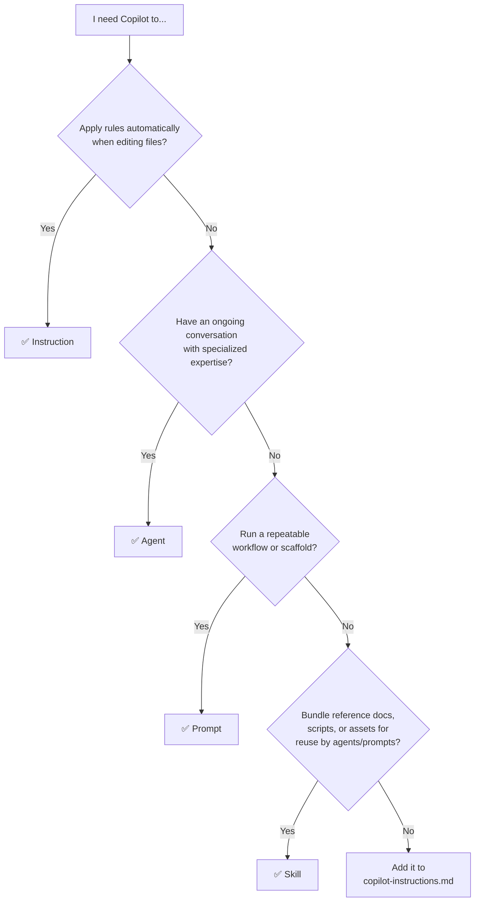

# Workspace Baseline

A curated library of reusable GitHub Copilot markdown files - **instructions**, **agents**, **prompts**, and **skills** - for bootstrapping and accelerating new coding projects.

## What This Is

This repository is a knowledge base, not an application. It contains portable template files that teach GitHub Copilot how to work within specific technology stacks, follow development workflows, and maintain code quality standards.

Copy what you need into your project's `.github/` folder, customize to fit, and move on.

## Copilot MD File Types

GitHub Copilot uses four types of markdown files, each with a distinct role. VS Code loads them from `.github/` in your project root.

| Type | VS Code Path | Loaded | Purpose |
|------|-------------|--------|---------|
| **copilot-instructions.md** | `.github/copilot-instructions.md` | Always - every Copilot request | Project-wide context: tech stack, hard rules, conventions, and tool routing |
| **Instructions** | `.github/instructions/*.instructions.md` | Automatically, filtered by `applyTo` glob | Persistent rules applied to every request matching a file pattern |
| **Agents** | `.github/agents/*.agent.md` | On demand via `@agent-name` | Specialized persona with scoped behavior for a task category |
| **Prompts** | `.github/prompts/*.prompt.md` | On demand via `/prompt-name` | Reusable workflow trigger - a scripted starting point for a task |
| **Skills** | `.github/skills/*/SKILL.md` | Referenced by agents/prompts | Bundled domain knowledge with scripts, references, or assets |

### How they differ

- **Instructions** are passive context - Copilot reads them silently when you edit matching files. They set coding standards, conventions, and guardrails without any user action.
- **Agents** are interactive personas - you invoke them for a conversation. They carry specialized expertise and behavioral rules for a category of work (e.g., TDD, code review, debugging).
- **Prompts** are one-shot workflow starters - they template a specific task with variables like `${file}` and kick off a structured action. Think "run this playbook."
- **Skills** are reference bundles - they package domain knowledge, scripts, and assets that agents or prompts can pull in. They don't run on their own.

### When to use which



### Context budget

Every file Copilot loads consumes context window tokens. More files loaded means less room for your actual code and conversation.

- **copilot-instructions.md** loads on every request - keep it lean and directive, not informational
- **Instructions** that match `applyTo: '**'` load on every request too - reserve this for truly universal rules
- **Agents** and **prompts** only load when invoked, so they're cheaper - put specialized knowledge there instead of in always-on instructions
- **Skills** are only pulled in by reference, making them ideal for large reference material that shouldn't always be in context

Rule of thumb: if Copilot's responses feel generic or it starts ignoring your rules, you're likely loading too much context. Narrow your `applyTo` globs and move specialized knowledge into agents or skills.

### Tools and MCP servers

Beyond markdown files, Copilot agents can call **tools** - functions that let them take real actions like running terminal commands, reading files, searching code, or querying external APIs.

VS Code provides built-in tools automatically. You extend them with **MCP (Model Context Protocol) servers** - lightweight services that expose domain-specific tools through a standardized JSON-RPC interface. Any MCP server works with any MCP-compatible client, making them portable across editors and AI platforms.

| Tool source | Examples | Value |
|-------------|----------|-------|
| **VS Code built-in** | File read/write, terminal, search, diagnostics | Core editor actions - always available, no setup |
| **MCP servers** | GitHub API, Brave Search, Microsoft Docs, library docs (Context7) | External knowledge and actions via a standard protocol |
| **Custom MCP servers** | Project-specific APIs, internal databases, CI/CD triggers | Extend Copilot's reach to your own systems |

MCP servers are referenced in your VS Code settings (`.vscode/mcp.json` or `settings.json`) and agents can use them by tool name. The key benefit is **standardized communication** - one protocol for discovery, invocation, and response, so agents don't need custom integration code for each service.

In this library, `copilot-instructions.md` includes a routing table mapping common needs to specific MCP tools, so agents know which tool to call without guessing.

## Quick Start

1. Open this workspace alongside your target project in VS Code
2. **Generate a `copilot-instructions.md` for your project** - use `/copilot-instructions-blueprint-generator` to scaffold one tailored to your tech stack, or run `/init` in a new workspace for a minimal starter
3. Cherry-pick from `instructions/`, `agents/`, `prompts/`, and `skills/` based on your needs
4. Customize downstream copies freely - divergence is expected and encouraged

## Repository Structure

```
instructions/       Coding standards, patterns, and conventions per technology
agents/             Specialized AI personas for specific development tasks
prompts/            Reusable workflow triggers and generators
skills/             Bundled domain knowledge with scripts and reference assets
.specify/           SpecKit framework templates for spec-driven development
.github/            Files active in THIS workspace (drawn from root)
```

**Root folders are the authoritative library.** The `.github/` folder is a downstream consumer - the same way any project would use these files.

## What's Inside

### Instructions (30 templates)

Technology-specific coding standards that Copilot auto-loads based on file type.

| Area | Examples |
|------|----------|
| **Backend** | PowerShell 7, InvokeBuild tasks, Microsoft Graph SDK |
| **Frontend** | JavaScript ES6, Alpine.js + Chart.js dashboards, HTML/CSS |
| **Testing** | Pester 5, Vitest + jsdom, Playwright (TypeScript) |
| **Data** | SQLite schema & queries |
| **Infrastructure** | Docker best practices, TypeScript MCP servers, Python MCP servers |
| **Quality** | Security/OWASP, code review, performance, self-documenting code |
| **Process** | Versioning, documentation updates, spec-driven workflow |
| **Meta** | How to author instructions, agents, prompts, and skills |

### Agents (23 definitions)

Specialized AI personas invoked via `@agent-name` in Copilot Chat.

| Category | Agents |
|----------|--------|
| **TDD Workflow** | `tdd-red`, `tdd-green`, `tdd-refactor` |
| **Quality** | `code-review`, `debug-mode`, `critical-thinking` |
| **Documentation** | `se-technical-writer`, `adr-generator` |
| **Research** | `research-technical-spike`, `context7` |
| **Building** | `prompt-builder`, `playwright-tester`, `4.1-Beast` |
| **M365 / MCP** | `mcp-m365-agent-expert` |
| **SpecKit** | `speckit.specify`, `speckit.plan`, `speckit.tasks`, and 6 more |

### Prompts (23 triggers)

Workflow starters invoked via `/prompt-name` in Copilot Chat.

| Category | Prompts |
|----------|---------|
| **Development** | `workon.myidea` (ad-hoc work), `workon.spec` (spec-driven features) |
| **Scaffolding** | MCP server generators (Python, TypeScript), Dockerfile, Playwright tests |
| **Architecture** | Blueprint generators, tech stack blueprints, `copilot-instructions` starter |
| **SpecKit** | Plan, specify, clarify, analyze, checklist, implement, tasks |

### Skills (11 bundles)

Domain knowledge packages with embedded scripts, references, or assets.

Includes: `copilot-sdk`, `chrome-devtools`, `excalidraw-diagram-generator`, `mcp-cli`, `microsoft-docs`, `microsoft-code-reference`, `microsoft-skill-creator`, `plantuml-ascii`, `prd`, `refactor`, `webapp-testing`

## Tech Stack Coverage

These templates are built around the following technologies, though many are language-agnostic:

- **PowerShell 7.5+** / InvokeBuild / Pester 5.7+
- **JavaScript ES6+** / Alpine.js 3.x / Chart.js 4.x / esbuild
- **TypeScript** / Vitest / Playwright
- **Docker** (Python/Node isolation, multi-stage builds)
- **SQLite** (Microsoft.Data.Sqlite, sql.js WASM)
- **Microsoft 365** / Graph SDK / Declarative Agents / MCP
- **MCP Servers** (Python + TypeScript, Docker-hosted)

## Docs

> *This section will grow as project documentation is added.*

| Area | Path | Description |
|------|------|-------------|
| Architecture | `docs/architecture/` | System design decisions and patterns |
| ADRs | `docs/adr/` | Architecture Decision Records |
| Development | `docs/development/` | Contributing, workflows, and iteration logs |
| Prompt Craft | `docs/prompt-craft/` | Refined prompt techniques and experiments |

## Conventions

- **Instruction files** require `description` and `applyTo` in YAML frontmatter
- **Agent files** require `description` and `name` in YAML frontmatter
- **Naming**: `{technology}.instructions.md`, `{purpose}.agent.md`, `{workflow}.prompt.md`
- **No sync enforcement** - downstream copies in projects are expected to diverge

For full authoring standards and hard rules, see [`.github/copilot-instructions.md`](.github/copilot-instructions.md).

## Attribution

Many of the templates in this library were sourced from or inspired by [awesome-copilot](https://github.com/github/awesome-copilot), a community-curated collection of GitHub Copilot instructions and agents.  
Templates sourced externally are reviewed and adapted to be project- and tech-agnostic where appropriate.

## License

This is a personal template library. See individual files for attribution where sourced from community resources.
