# Workspace Baseline

A curated library of reusable GitHub Copilot markdown files — **instructions**, **agents**, **prompts**, and **skills** — for bootstrapping and accelerating new coding projects.

> **This is a knowledge base, not an application.** Copy what you need into your project's `.github/` folder, customize to fit, and move on. Files marked 🏠 are home-grown; files marked 🔗 are sourced/inspired from [awesome-copilot](https://github.com/github/awesome-copilot).

---

## Quick Start

```
1.  Open this workspace alongside your target project
2.  Run  /copilot-instructions-blueprint-generator   to scaffold a copilot-instructions.md
3.  Cherry-pick instructions, agents, prompts, and skills you need
4.  Customize freely — downstream divergence is expected
```

---

## How GitHub Copilot Uses These Files

VS Code loads Copilot customization files from `.github/` in your project root. Each type has a distinct role:

| Type | Path | Loaded | Purpose |
|------|------|--------|---------|
| **copilot-instructions.md** | `.github/copilot-instructions.md` | Every request | Project-wide context: tech stack, hard rules, MCP tool routing |
| **Instructions** | `.github/instructions/*.instructions.md` | Auto, by `applyTo` glob | Coding standards applied silently when editing matching files |
| **Agents** | `.github/agents/*.agent.md` | On demand `@agent` | Interactive persona with scoped expertise for a task category |
| **Prompts** | `.github/prompts/*.prompt.md` | On demand `/prompt` | One-shot workflow starter — a scripted playbook for a task |
| **Skills** | `.github/skills/*/SKILL.md` | By reference | Bundled domain knowledge, scripts, and assets for agents/prompts |

### When to use which

```mermaid
flowchart TD
    A[I need Copilot to...] --> B{Apply rules automatically\nwhen editing files?}
    B -- Yes --> C[✅ Instruction]
    B -- No --> D{Have an ongoing conversation\nwith specialized expertise?}
    D -- Yes --> E[✅ Agent]
    D -- No --> F{Run a repeatable\nworkflow or scaffold?}
    F -- Yes --> G[✅ Prompt]
    F -- No --> H{Bundle reference docs\nor assets for reuse?}
    H -- Yes --> I[✅ Skill]
    H -- No --> J[Add to copilot-instructions.md]
```



### Context budget tips

- **copilot-instructions.md** and `applyTo: '**'` instructions load on *every* request — keep them lean
- **Agents** and **prompts** only load when invoked — put specialized knowledge there
- **Skills** are pulled in by reference — ideal for large reference material
- If Copilot starts ignoring your rules, you're probably loading too much context

---

## Repository Structure

```
instructions/       Coding standards and conventions per technology
agents/             Specialized AI personas for development tasks
prompts/            Reusable workflow triggers and generators
skills/             Bundled domain knowledge with scripts and assets
docs/               Architecture decisions, prompt-craft notes, spike research
```

**Root folders are the authoritative library.** Copy files into your project's `.github/` folder to activate them.

---

## Featured Prompts 🏠

These are the home-grown workflow prompts that drive day-to-day development:

| Prompt | Invoke | What it does |
|--------|--------|--------------|
| **workon.myidea** | `/workon.myidea` | Structured workflow for bug fixes, small features, and refactors. Routes large work to `workon.myspec`. |
| **workon.myspec** | `/workon.myspec` | Coordinator for spec-driven feature development. Depends on [SpecKit](https://github.com/github/spec-kit) agents and templates. |
| **validate.myprompt** | `/validate.myprompt` | Dispatches three parallel specialist reviews ([critical-thinking](agents/critical-thinking.agent.md), [code-review](agents/code-review.agent.md), [prompt-builder](agents/prompt-builder.agent.md)) of a workspace template file (`.prompt.md`, `.agent.md`, `.instructions.md`, `SKILL.md`), then synthesizes a prioritized action plan. |

---

## Catalog

### Agents (14)

Specialized AI personas invoked via `@agent-name` in Copilot Chat.

| Agent | Description | Source |
|-------|-------------|--------|
| [4.1-Beast](agents/4.1-Beast.agent.md) | GPT 4.1 as a top-notch coding agent | [🔗](https://github.com/github/awesome-copilot/blob/main/agents/4.1-Beast.agent.md) |
| [adr-generator](agents/adr-generator.agent.md) | Creates Architecture Decision Records with structured formatting | [🔗](https://github.com/github/awesome-copilot/blob/main/agents/adr-generator.agent.md) |
| [code-review](agents/code-review.agent.md) | Code quality validator and compliance checker with fresh context analysis | [🏠](agents/code-review.agent.md) |
| [context7](agents/context7.agent.md) | Expert in latest library versions using up-to-date documentation via Context7 MCP | [🔗](https://github.com/github/awesome-copilot/blob/main/agents/context7.agent.md) |
| [critical-thinking](agents/critical-thinking.agent.md) | Challenges assumptions to ensure the best possible solution | [🔗](https://github.com/github/awesome-copilot/blob/main/agents/critical-thinking.agent.md) |
| [debug-mode](agents/debug-mode.agent.md) | Debug your application to find and fix a bug | [🏠](agents/debug-mode.agent.md) |
| [mcp-m365-agent-expert](agents/mcp-m365-agent-expert.agent.md) | Builds MCP-based declarative agents for Microsoft 365 Copilot | [🔗](https://github.com/github/awesome-copilot/blob/main/agents/mcp-m365-agent-expert.agent.md) |
| [playwright-tester](agents/playwright-tester.agent.md) | Testing mode for Playwright tests | [🔗](https://github.com/github/awesome-copilot/blob/main/agents/playwright-tester.agent.md) |
| [prompt-builder](agents/prompt-builder.agent.md) | Expert prompt engineering and validation system (microsoft/edge-ai) | [🔗](https://github.com/github/awesome-copilot/blob/main/agents/prompt-builder.agent.md) |
| [research-technical-spike](agents/research-technical-spike.agent.md) | Systematically research and validate technical spike documents | [🔗](https://github.com/github/awesome-copilot/blob/main/agents/research-technical-spike.agent.md) |
| [se-technical-writer](agents/se-technical-writer.agent.md) | Technical writing specialist for developer documentation and tutorials | [🔗](https://github.com/github/awesome-copilot/blob/main/agents/se-technical-writer.agent.md) |
| [tdd-red](agents/tdd-red.agent.md) | Write failing tests first from GitHub issue context | [🔗](https://github.com/github/awesome-copilot/blob/main/agents/tdd-red.agent.md) |
| [tdd-green](agents/tdd-green.agent.md) | Implement minimal code to make failing tests pass | [🔗](https://github.com/github/awesome-copilot/blob/main/agents/tdd-green.agent.md) |
| [tdd-refactor](agents/tdd-refactor.agent.md) | Improve quality and security while keeping tests green | [🔗](https://github.com/github/awesome-copilot/blob/main/agents/tdd-refactor.agent.md) |

### Prompts (15)

Workflow starters invoked via `/prompt-name` in Copilot Chat.

| Prompt | Description | Source |
|--------|-------------|--------|
| [workon.myidea](prompts/workon.myidea.prompt.md) | Structured workflow for bug fixes, small features, and refactors | [🏠](prompts/workon.myidea.prompt.md) |
| [workon.myspec](prompts/workon.myspec.prompt.md) | Coordinator for spec-driven feature development. Depends on [SpecKit](https://github.com/github/spec-kit). | [🏠](prompts/workon.myspec.prompt.md) |
| [validate.myprompt](prompts/validate.myprompt.prompt.md) | Parallel specialist review of a workspace template file with synthesized action plan | [🏠](prompts/validate.myprompt.prompt.md) |
| [architecture-blueprint-generator](prompts/architecture-blueprint-generator.prompt.md) | Analyzes codebases to create detailed architectural documentation | [🔗](https://github.com/github/awesome-copilot/blob/main/skills/architecture-blueprint-generator/SKILL.md) |
| [copilot-instructions-blueprint-generator](prompts/copilot-instructions-blueprint-generator.prompt.md) | Scaffolds a copilot-instructions.md tailored to your tech stack | [🔗](https://github.com/github/awesome-copilot/blob/main/skills/copilot-instructions-blueprint-generator/SKILL.md) |
| [create-agentsmd](prompts/create-agentsmd.prompt.md) | Generates an AGENTS.md file for a repository | [🔗](https://github.com/github/awesome-copilot/blob/main/skills/create-agentsmd/SKILL.md) |
| [create-technical-spike](prompts/create-technical-spike.prompt.md) | Creates time-boxed spike documents for critical technical decisions | [🔗](https://github.com/github/awesome-copilot/blob/main/skills/create-technical-spike/SKILL.md) |
| [documentation-writer](prompts/documentation-writer.prompt.md) | Diátaxis expert for creating structured technical documentation | [🔗](https://github.com/github/awesome-copilot/blob/main/skills/documentation-writer/SKILL.md) |
| [github-copilot-starter](prompts/github-copilot-starter.prompt.md) | Sets up complete GitHub Copilot configuration for a new project | [🔗](https://github.com/github/awesome-copilot/blob/main/skills/github-copilot-starter/SKILL.md) |
| [multi-stage-dockerfile](prompts/multi-stage-dockerfile.prompt.md) | Creates optimized multi-stage Dockerfiles for any language | [🔗](https://github.com/github/awesome-copilot/blob/main/skills/multi-stage-dockerfile/SKILL.md) |
| [playwright-generate-test](prompts/playwright-generate-test.prompt.md) | Generates Playwright tests from scenarios using Playwright MCP | [🔗](https://github.com/github/awesome-copilot/blob/main/skills/playwright-generate-test/SKILL.md) |
| [pytest-coverage](prompts/pytest-coverage.prompt.md) | Runs pytest with coverage analysis and drives toward 100% | [🔗](https://github.com/github/awesome-copilot/blob/main/skills/pytest-coverage/SKILL.md) |
| [python-mcp-server-generator](prompts/python-mcp-server-generator.prompt.md) | Scaffolds a complete MCP server project in Python | [🔗](https://github.com/github/awesome-copilot/blob/main/skills/python-mcp-server-generator/SKILL.md) |
| [technology-stack-blueprint-generator](prompts/technology-stack-blueprint-generator.prompt.md) | Detects and documents technology stacks with version info and diagrams | [🔗](https://github.com/github/awesome-copilot/blob/main/skills/technology-stack-blueprint-generator/SKILL.md) |
| [typescript-mcp-server-generator](prompts/typescript-mcp-server-generator.prompt.md) | Scaffolds a complete MCP server project in TypeScript | [🔗](https://github.com/github/awesome-copilot/blob/main/skills/typescript-mcp-server-generator/SKILL.md) |

### Instructions (30)

Coding standards Copilot auto-loads based on `applyTo` glob patterns.

| Instruction | Applies to | Description | Source |
|-------------|-----------|-------------|--------|
| [agent-skills](instructions/agent-skills.instructions.md) | `**/SKILL.md` | Guidelines for creating Agent Skills | [🔗](https://github.com/github/awesome-copilot/blob/main/instructions/agent-skills.instructions.md) |
| [agents](instructions/agents.instructions.md) | `**/*.agent.md` | Guidelines for creating custom agent files | [🔗](https://github.com/github/awesome-copilot/blob/main/instructions/agents.instructions.md) |
| [ai-prompt-engineering-safety-best-practices](instructions/ai-prompt-engineering-safety-best-practices.instructions.md) | `**` | Prompt engineering, safety, bias mitigation | [🔗](https://github.com/github/awesome-copilot/blob/main/instructions/ai-prompt-engineering-safety-best-practices.instructions.md) |
| [alpinejs-chartjs-dashboard](instructions/alpinejs-chartjs-dashboard.instructions.md) | `**/*.{js,html}` | Alpine.js 3.x + Chart.js 4.x dashboard patterns | [🏠](instructions/alpinejs-chartjs-dashboard.instructions.md) |
| [code-review-generic](instructions/code-review-generic.instructions.md) | `**` | Generic code review checklist | [🔗](https://github.com/github/awesome-copilot/blob/main/instructions/code-review-generic.instructions.md) |
| [containerization-docker-best-practices](instructions/containerization-docker-best-practices.instructions.md) | Dockerfile globs | Multi-stage builds, security scanning, runtime | [🔗](https://github.com/github/awesome-copilot/blob/main/instructions/containerization-docker-best-practices.instructions.md) |
| [context-engineering](instructions/context-engineering.instructions.md) | `**` | Structuring code to maximize Copilot effectiveness | [🔗](https://github.com/github/awesome-copilot/blob/main/instructions/context-engineering.instructions.md) |
| [copilot-sdk-python](instructions/copilot-sdk-python.instructions.md) | `**.py` | Building Python apps with GitHub Copilot SDK | [🔗](https://github.com/github/awesome-copilot/blob/main/instructions/copilot-sdk-python.instructions.md) |
| [copilot-thought-logging](instructions/copilot-thought-logging.instructions.md) | `**` | Trace Copilot's reasoning process | [🔗](https://github.com/github/awesome-copilot/blob/main/instructions/copilot-thought-logging.instructions.md) |
| [declarative-agents-microsoft365](instructions/declarative-agents-microsoft365.instructions.md) | `**.json, **.ts` | M365 Copilot declarative agents (schema v1.5) | [🔗](https://github.com/github/awesome-copilot/blob/main/instructions/declarative-agents-microsoft365.instructions.md) |
| [html-css-style-color-guide](instructions/html-css-style-color-guide.instructions.md) | `**/*.html, **/*.css` | Accessible color and styling rules | [🔗](https://github.com/github/awesome-copilot/blob/main/instructions/html-css-style-color-guide.instructions.md) |
| [instructions](instructions/instructions.instructions.md) | `**/*.instructions.md` | Meta: how to author instruction files | [🔗](https://github.com/github/awesome-copilot/blob/main/instructions/instructions.instructions.md) |
| [invokebuild-tasks](instructions/invokebuild-tasks.instructions.md) | `**/*.build.ps1` | InvokeBuild task patterns for PowerShell | [🏠](instructions/invokebuild-tasks.instructions.md) |
| [javascript-es6-browser](instructions/javascript-es6-browser.instructions.md) | `**/*.{js,html}` | JavaScript ES6+ browser patterns with esbuild | [🏠](instructions/javascript-es6-browser.instructions.md) |
| [markdown-documentation](instructions/markdown-documentation.instructions.md) | `docs/**/*.md` | Markdown standards, cross-references, Mermaid | [🏠](instructions/markdown-documentation.instructions.md) |
| [mcp-m365-copilot](instructions/mcp-m365-copilot.instructions.md) | MCP/agent globs | MCP-based agents and API plugins for M365 | [🔗](https://github.com/github/awesome-copilot/blob/main/instructions/mcp-m365-copilot.instructions.md) |
| [microsoft-graph-sdk](instructions/microsoft-graph-sdk.instructions.md) | `**/*.ps1` | Microsoft Graph PowerShell SDK 2.0+ patterns | [🏠](instructions/microsoft-graph-sdk.instructions.md) |
| [nodejs-javascript-vitest](instructions/nodejs-javascript-vitest.instructions.md) | `**/*.js` | Node.js + JavaScript with Vitest testing | [🔗](https://github.com/github/awesome-copilot/blob/main/instructions/nodejs-javascript-vitest.instructions.md) |
| [performance-optimization](instructions/performance-optimization.instructions.md) | `*` | Cross-stack performance optimization | [🔗](https://github.com/github/awesome-copilot/blob/main/instructions/performance-optimization.instructions.md) |
| [playwright-typescript](instructions/playwright-typescript.instructions.md) | `**` | Playwright TypeScript test patterns | [🔗](https://github.com/github/awesome-copilot/blob/main/instructions/playwright-typescript.instructions.md) |
| [powershell-7](instructions/powershell-7.instructions.md) | `**/*.ps1` | PowerShell 7.5+ coding standards | [🏠](instructions/powershell-7.instructions.md) |
| [powershell-pester-5](instructions/powershell-pester-5.instructions.md) | `**/*.Tests.ps1` | Pester 5 testing best practices | [🔗](https://github.com/github/awesome-copilot/blob/main/instructions/powershell-pester-5.instructions.md) |
| [prompt](instructions/prompt.instructions.md) | `**/*.prompt.md` | Meta: how to author prompt files | [🔗](https://github.com/github/awesome-copilot/blob/main/instructions/prompt.instructions.md) |
| [security-and-owasp](instructions/security-and-owasp.instructions.md) | `**` | Secure coding based on OWASP Top 10 | [🔗](https://github.com/github/awesome-copilot/blob/main/instructions/security-and-owasp.instructions.md) |
| [self-explanatory-code-commenting](instructions/self-explanatory-code-commenting.instructions.md) | `**` | Write self-documenting code, comment only "why" | [🔗](https://github.com/github/awesome-copilot/blob/main/instructions/self-explanatory-code-commenting.instructions.md) |
| [spec-driven-workflow-v1](instructions/spec-driven-workflow-v1.instructions.md) | `**` | Structured spec → plan → implement workflow | [🔗](https://github.com/github/awesome-copilot/blob/main/instructions/spec-driven-workflow-v1.instructions.md) |
| [sqlite-schema-queries](instructions/sqlite-schema-queries.instructions.md) | `**/*.sql` | SQLite schema design and query patterns | [🏠](instructions/sqlite-schema-queries.instructions.md) |
| [typescript-mcp-server](instructions/typescript-mcp-server.instructions.md) | `**/*.ts, **/*.js` | Building MCP servers with TypeScript SDK | [🔗](https://github.com/github/awesome-copilot/blob/main/instructions/typescript-mcp-server.instructions.md) |
| [update-docs-on-code-change](instructions/update-docs-on-code-change.instructions.md) | code + docs globs | Auto-update docs when code changes | [🔗](https://github.com/github/awesome-copilot/blob/main/instructions/update-docs-on-code-change.instructions.md) |
| [versioning-management](instructions/versioning-management.instructions.md) | `**/package.json` etc. | SemVer and release automation rules | [🏠](instructions/versioning-management.instructions.md) |

### Skills (11)

Domain knowledge packages with embedded scripts, references, or assets.

| Skill | Description | Source |
|-------|-------------|--------|
| [agentic-eval](skills/agentic-eval/SKILL.md) | Evaluator-optimizer pipelines, self-critique loops, LLM-as-judge | [🔗](https://github.com/github/awesome-copilot/blob/main/skills/agentic-eval/SKILL.md) |
| [chrome-devtools](skills/chrome-devtools/SKILL.md) | Browser automation, debugging, and performance via Chrome DevTools MCP | [🔗](https://github.com/github/awesome-copilot/blob/main/skills/chrome-devtools/SKILL.md) |
| [copilot-sdk](skills/copilot-sdk/SKILL.md) | Build agentic apps with GitHub Copilot SDK, MCP servers, custom agents | [🔗](https://github.com/github/awesome-copilot/blob/main/skills/copilot-sdk/SKILL.md) |
| [make-skill-template](skills/make-skill-template/SKILL.md) | Scaffold new SKILL.md files with proper structure | [🔗](https://github.com/github/awesome-copilot/blob/main/skills/make-skill-template/SKILL.md) |
| [mcp-cli](skills/mcp-cli/SKILL.md) | Interface with MCP servers from the command line | [🔗](https://github.com/github/awesome-copilot/blob/main/skills/mcp-cli/SKILL.md) |
| [microsoft-code-reference](skills/microsoft-code-reference/SKILL.md) | Look up Microsoft API references and verify SDK code | [🔗](https://github.com/github/awesome-copilot/blob/main/skills/microsoft-code-reference/SKILL.md) |
| [microsoft-skill-creator](skills/microsoft-skill-creator/SKILL.md) | Create agent skills for any Microsoft technology via Learn MCP | [🔗](https://github.com/github/awesome-copilot/blob/main/skills/microsoft-skill-creator/SKILL.md) |
| [powershell-7](skills/powershell-7/SKILL.md) | PowerShell 7 best practices, performance, cross-platform, Pester | [🏠](skills/powershell-7/SKILL.md) |
| [prd](skills/prd/SKILL.md) | Generate Product Requirements Documents with user stories and risk analysis | [🔗](https://github.com/github/awesome-copilot/blob/main/skills/prd/SKILL.md) |
| [refactor](skills/refactor/SKILL.md) | Surgical code refactoring — extract, rename, decompose, improve types | [🔗](https://github.com/github/awesome-copilot/blob/main/skills/refactor/SKILL.md) |
| [webapp-testing](skills/webapp-testing/SKILL.md) | Test local web apps with Playwright — screenshots, logs, UI verification | [🔗](https://github.com/github/awesome-copilot/blob/main/skills/webapp-testing/SKILL.md) |

---

## SpecKit Integration

The `workon.myspec` prompt depends on [SpecKit](https://github.com/github/spec-kit), which provides spec-driven development workflows with agents and templates for taking features from idea → spec → plan → tasks → implementation. SpecKit files (`.specify/`, `speckit.*` agents/prompts) are included in this repo as a dependency.

---

## Tech Stack Coverage

Templates are built around these technologies, though many are language-agnostic:

| Stack | Technologies |
|-------|-------------|
| **PowerShell** | PowerShell 7.5+, InvokeBuild, Pester 5.7+, Microsoft Graph SDK |
| **JavaScript** | ES6+, Alpine.js 3.x, Chart.js 4.x, esbuild |
| **TypeScript** | Vitest, Playwright, MCP Server SDK |
| **Infrastructure** | Docker (multi-stage builds, Python/Node isolation) |
| **Data** | SQLite (Microsoft.Data.Sqlite, sql.js WASM) |
| **Microsoft 365** | Graph SDK, Declarative Agents, MCP, Copilot SDK |

---

## MCP Tools

Copilot agents extend their reach via MCP (Model Context Protocol) servers. The `copilot-instructions.md` includes a routing table so agents know which tool to call:

| Need | MCP Tool |
|------|----------|
| PowerShell/.NET patterns | `mcp_microsoftdocs_microsoft_docs_search` |
| Library/framework docs | `mcp_context7_resolve-library-id` → `mcp_context7_get-library-docs` |
| Current versions/APIs | `mcp_brave-search_brave_web_search` |
| Community MD files | `mcp_awesome-copil_search_instructions` |
| Complex reasoning | `mcp_sequential-th_sequentialthinking` |

---

## Docs

| Area | Path | Contents |
|------|------|----------|
| ADRs | `docs/adr/` | Architecture Decision Records |
| Architecture | `docs/architecture/` | System design decisions and patterns |
| Development | `docs/development/` | Contributing, workflows, and iteration logs |
| Prompt Craft | `docs/prompt-craft/` | Refined prompt techniques and lessons learned |
| Spikes | `docs/spikes/` | Technical spike research documents |

---

## Conventions

| Rule | Detail |
|------|--------|
| Instruction frontmatter | Requires `description` and `applyTo` |
| Agent frontmatter | Requires `description` and `name` |
| Naming | `{technology}.instructions.md`, `{purpose}.agent.md`, `{workflow}.prompt.md` |
| Root is authoritative | All templates originate in root folders; `.github/` draws from root |
| Downstream divergence | Expected and encouraged — no sync enforcement |

Full authoring standards: [.github/copilot-instructions.md](.github/copilot-instructions.md)

---

## Attribution

Templates marked 🔗 are sourced from or inspired by [github/awesome-copilot](https://github.com/github/awesome-copilot), a community-curated collection. All sourced templates are reviewed and adapted to be project- and tech-agnostic.

## License

Personal template library. See individual files for attribution where sourced from community resources.
