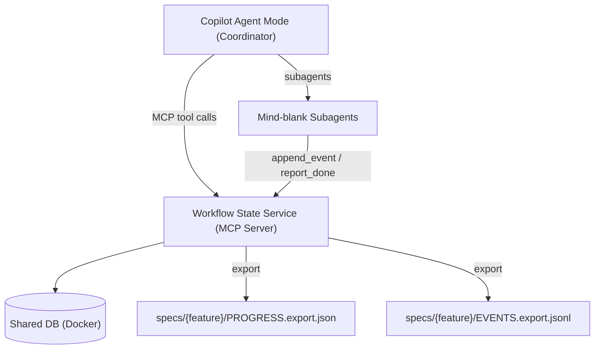

# Comprehensive Recommendation: MCP‑Backed Workflow State Service (Shared DB) for VS Code Copilot Agent Mode

> **✅ Implemented** — This recommendation was fully implemented. The standalone project lives at [`workflow-state-service-mcp`](../../../../workflow-state-service-mcp) (307/307 tests passing).

**Context:** Multi‑phase, spec‑driven workflow in **GitHub Copilot Chat (Agent mode) in VS Code**, using **markdown prompts + instruction files + skills**, and delegating to fresh‑context subagents; tools are a first‑class mechanism in agent mode.
**Decision:** Use a **single shared local database** behind a **local MCP server** as the only interface for workflow state + event receipts. Export a final snapshot back into the spec folder at closeout.

---

## 1) Executive Summary

### What to build

A local MCP server (the **Workflow State Service**) exposing a minimal tool surface:

- `workflow.create`, `workflow.listActive`, `workflow.get_state`
- `workflow.append_event`, `workflow.get_events`
- `workflow.transition` (**coordinator‑only**)
- `workflow.export`, `workflow.close`  

VS Code agent mode is built around choosing and invoking tools (built‑in, MCP, extension tools) to accomplish work.

### Why it solves your current workflow issues

- **Chat compaction** can’t erase progress because state and receipts live outside chat and are retrieved by tools.
- **Concurrency** works: multiple workflows and subagents write safely without clobbering a single file (DB concurrency control avoids lost updates).
- **No shortcutting:** transitions are tool‑enforced (legal transitions + evidence), not “interpreted” from a summarized prompt.
- **Subagent outputs can’t be lost:** subagents append durable events; the coordinator replays by cursor. Event logs are widely used for auditability/replay.

### End-of-life policy (your preference)

Treat the DB volume as disposable and export final artifacts:

- `specs/<feature>/PROGRESS.export.json`
- `specs/<feature>/EVENTS.export.jsonl`

---

## 2) Architecture Overview

### 2.1 High‑level flow (Mermaid)

> GitHub’s Mermaid renderer requires a fenced `mermaid` code block.

### 2.2 Why DB for active state

Databases are designed for concurrent access and transactional consistency (avoids lost updates and inconsistent state under overlap).

### 2.3 Why an append‑only event log (even if state is disposable)

Keeping an append‑only stream of “what happened” enables deterministic replay/recovery during the workflow and supports post‑hoc traceability; this is a core motivation of event sourcing patterns.

---

## 3) Authority Model (Hard Rule)

### 3.1 Coordinator = the only state mutator

- Only the coordinator can call `workflow.transition()`.
- Transition enforces:
  - legal phase movement
  - required evidence (tests pass, errors clean, checklists complete, etc.)

This prevents “validation was summarized away so the agent skipped it.”

### 3.2 Subagents = append‑only receipts

- Subagents may call `get_state()` and `get_events()`.
- Subagents may call `append_event()` and `report_subagent_done()`.
- Subagents **must not** mutate phase status/counters.

This preserves your existing coordinator→subagent pattern and avoids file clobbering.

---

## 4) Minimal MCP Tool Surface (KISS)

### 4.1 Discovery & resume

- `workflow.listActive() -> [{workflowId, feature, branch, phase, status, updatedAt}]`
- `workflow.get_state(workflowId) -> ProgressState`

This eliminates dependence on “chat session IDs” by making resumption deterministic via lookup.

### 4.2 Subagent receipts

- `workflow.append_event(workflowId, event) -> {eventId, cursor}`
- `workflow.report_subagent_done(workflowId, runId, summary, artifacts, evidence) -> {eventId}`
- `workflow.get_events(workflowId, since_cursor|since_time) -> {events, next_cursor}`

Prefer `since_cursor` for deterministic ordering (timestamps can be optional convenience).

### 4.3 Coordinator transition + closeout

- `workflow.transition(workflowId, from, to, evidence) -> ProgressState`
- `workflow.export(workflowId, specDir) -> {progress_export_path, events_export_path}`
- `workflow.close(workflowId)`

Export preserves posterity without treating the runtime store as a long‑term asset.

---

## 5) Shared DB Schema (Conceptual)

### Tables

- `workflows(workflow_id, feature_name, branch_name, spec_dir, created_at, updated_at)`
- `workflow_state(workflow_id, progress_state_json, current_phase_key, state_version)`
- `workflow_events(event_id, workflow_id, seq, timestamp, actor_kind, actor_name, actor_run_id, phase_key, event_type, payload_json)`

This cleanly separates “current state” from append‑only “events,” which improves auditability and replay.

---

## 6) Integration with your existing markdown agents/skills

- Keep `.github/copilot-instructions.md` as repo‑wide policy and `.github/instructions/*.instructions.md` for scoped rules.
- Update each `.agent.md` persona to include a hard rule: **write a durable receipt** via `report_subagent_done()` and include the `eventId` in the final response. Your current “fresh context reviewer” style already emphasizes strict boundaries and targeted outputs.

---

## 7) Implementation Plan (Incremental)

### Phase A — MVP state service (2–3 days)

- Implement the tool set in Section 4.
- Implement shared DB tables in Section 5.
- Enforce coordinator-only `transition()`.

### Phase B — Wire into coordinator + subagents (1–2 days)

- Coordinator always calls `get_state()` at phase start and `get_events()` before transitioning.
- Subagents append events and call `report_subagent_done()`.

### Phase C — Contract-first hardening (optional)

Use TypeSpec as the source of truth for:

- `ProgressState`, `WorkflowEvent`, and tool request/response shapes
Then emit JSON Schema and validate tool payloads at the MCP boundary. TypeSpec is explicitly designed to emit JSON Schema from TypeSpec definitions.

---

## 8) Acceptance Criteria

1. Two workflows can be active concurrently with no state collisions.
2. Subagent completion is always recoverable via `get_events()` even if chat is compacted.
3. `transition()` refuses phase completion without evidence; no shortcutting.
4. Export produces `PROGRESS.export.json` and `EVENTS.export.jsonl` in `specs/<feature>/`.
