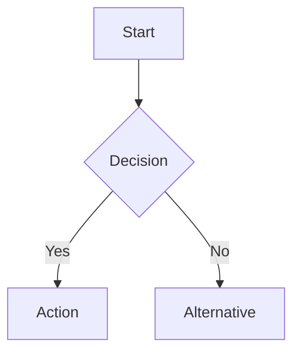

# Documentation Standards

## File Linking Format

```markdown
# ✅ GOOD: Workspace-relative paths with section anchors
See [ARCHITECTURE.md](architecture/ARCHITECTURE.md#component-name) for details.
Read [powershell.md lines 250-350](reference/best-practices/powershell.md) for patterns.

# ❌ BAD: Absolute paths or missing section references
See C:\Users\...\ARCHITECTURE.md
See powershell.md (no guidance on where to look)
```

## Navigation Maintenance

When adding new documentation files:

1. Update the documentation index/table of contents with the new entry
2. Add to navigation guides or component maps if applicable
3. Add breadcrumb navigation at top: `[← Back to Index](../INDEX.md)`
4. Update related cross-references in other docs

## Cross-Reference Format

```markdown
**See Also:**
- [Data Flow Phase 3](../architecture/DATA-FLOW.md#phase-3)
- [Best Practices: PowerShell](../reference/best-practices/powershell.md)
- [Design Decision DD-009](../architecture/DESIGN-DECISIONS.md#dd-009)

**Related:**
- [Feature Spec](../../specs/feature-name/spec.md)
- [ADR-001](../adr/001-technology-choice.md)
```

## Code Reference Format

```markdown
**Implementation:** [Get-DataItems.ps1 lines 148-215](../../src/private/Get-DataItems.ps1)

**See:** [Start-Pipeline.ps1](../../src/public/Start-Pipeline.ps1#L89-L146)
```

## Markdown Standards

- Use ATX-style headers (`#` not underlines)
- Code blocks with language tags (```powershell, ```javascript, ```sql)
- Tables for structured data comparisons
- Inline code for technical terms: `FunctionName`, `$variable`
- One blank line before and after headers, code blocks, and lists

## Mermaid Diagrams

````markdown

````

**Mermaid Rules:**
- ✅ Use for architecture diagrams, data flows, and decision trees
- ✅ Keep diagrams focused (max ~15 nodes for readability)
- ✅ Use consistent node shapes: `[]` for process, `{}` for decision, `()` for terminal

## AI Navigation Strategies (Large Files)

For documentation files exceeding 600 lines, include navigation aids:

```markdown
## AI Navigation Strategies

### Line Number Table
| Section | Lines | Purpose |
|---------|-------|---------|
| Overview | 1-50 | Architecture context |
| Component A | 51-200 | Component details |
| Component B | 201-400 | Component details |
| API Reference | 401-600 | Function signatures |
```

This enables AI agents to use targeted `read_file` calls instead of reading entire files, reducing token consumption ~90%.
